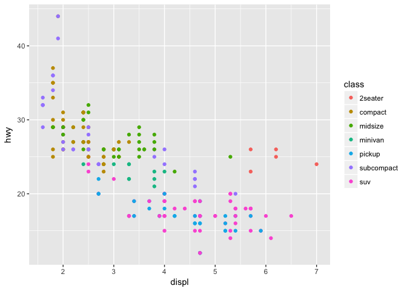
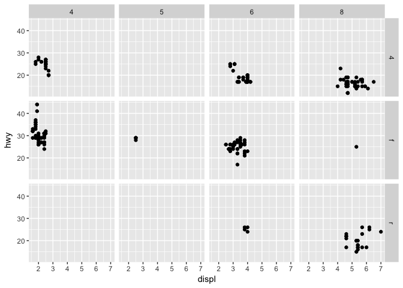

# Assignment_3


## R Markdown

This is an R Markdown document. Markdown is a simple formatting syntax for authoring HTML, PDF, and MS Word documents. For more details on using R Markdown see <http://rmarkdown.rstudio.com>.

When you click the **Knit** button a document will be generated that includes both content as well as the output of any embedded R code chunks within the document. You can embed an R code chunk like this:


```r
library(tidyverse)
```

```
## Loading tidyverse: ggplot2
## Loading tidyverse: tibble
## Loading tidyverse: tidyr
## Loading tidyverse: readr
## Loading tidyverse: purrr
## Loading tidyverse: dplyr
```

```
## Conflicts with tidy packages ----------------------------------------------
```

```
## filter(): dplyr, stats
## lag():    dplyr, stats
```


```r
ggplot(data = mpg) + 
  geom_point(mapping = aes(x = displ, y = hwy))
```

<!-- -->

### Excercise 3.2.4


```r
# question 1 
ggplot(data=mpg)
```

<!-- -->

```r
# Do not see anything

# question 2
nrow(mtcars)
```

```
## [1] 32
```

```r
ncol(mtcars)
```

```
## [1] 11
```

```r
#  there are 32 rows and 11 columns

# question 3
?mpg
# drv is what type of drive, either front wheel, rear wheel, or 4 wheel drive

# question 4
ggplot(data = mpg) + 
  geom_point(mapping = aes(x = cyl, y = hwy))
```

<!-- -->

```r
# question 5
ggplot(data = mpg) + 
  geom_point(mapping = aes(x = class, y = drv))
```

<!-- -->

```r
# this is not useful because there are only one to three points for each, both are categorical variables, and plotting them does not give any useful information.
```

### Excercise 3.3.1


```r
# question 1
ggplot(data = mpg) + 
  geom_point(mapping = aes(x = displ, y = hwy, color = "blue"))
```

<!-- -->

```r
ggplot(data = mpg) + 
  geom_point(mapping = aes(x = displ, y = hwy), color = "blue")
```

<!-- -->

```r
# the color = blue was inside the () of the aes, where it needs to be outside and within the geom_point

# question 2
?mpg
# categorical variables are: model, year, cyl, trans, drive, fuel type, and class
# continious variables are: city, hwy

#3
#ggplot(data = mpg) + 
#geom_point(mapping = aes(x = displ, y = hwy, shape = cty))
#ggplot(data = mpg) + 
  geom_point(mapping = aes(x = displ, y = hwy, size = cty))
```

```
## mapping: x = displ, y = hwy, size = cty 
## geom_point: na.rm = FALSE
## stat_identity: na.rm = FALSE
## position_identity
```

```r
ggplot(data = mpg) + 
  geom_point(mapping = aes(x = displ, y = hwy, color = cty))
```

<!-- -->

```r
ggplot(data = mpg) + 
  geom_point(mapping = aes(x = displ, y = hwy, color = class))
```

<!-- -->

```r
# shape cannot use a continous variable

# question 4
ggplot(data = mpg) + 
  geom_point(mapping = aes(x = displ, y = hwy, color = class, shape=class))
```

```
## Warning: The shape palette can deal with a maximum of 6 discrete values
## because more than 6 becomes difficult to discriminate; you have 7.
## Consider specifying shapes manually if you must have them.
```

```
## Warning: Removed 62 rows containing missing values (geom_point).
```

<!-- -->

```r
# question 5
?geom_point
ggplot(data = mpg) + 
  geom_point(mapping = aes(x = displ, y = hwy), shape = 21, stroke = 2)
```

<!-- -->

```r
# stroke is the size of the border of shapes that have borders.

# question 6
ggplot(data = mpg) + 
  geom_point(mapping = aes(x = displ, y = hwy, shape=cty > 20))
```

<!-- -->

```r
# gives a shape or color or such to both true and false.
```

### Excercise 3.5.1


```r
# question 1
ggplot(data = mpg) + 
  geom_point(mapping = aes(x = displ, y = hwy)) + 
  facet_wrap(~ cty)
```

<!-- -->

```r
# with continous variables, there can be too many plots.

# question 2

ggplot(data = mpg) + 
  geom_point(mapping = aes(x = displ, y = hwy)) + 
  facet_grid(drv ~ cyl)
```

<!-- -->

```r
ggplot(data = mpg) + 
  geom_point(mapping = aes(x = drv, y = cyl))
```

<!-- -->

```r
# the empty cells mean there is no data for that combination of arguments, ie no 5 cyl with 4 wheel drive. You can see that in the other graph as there is no data point for that combination. 

# question 3

ggplot(data = mpg) + 
  geom_point(mapping = aes(x = displ, y = hwy)) +
  facet_grid(drv ~ .)
```

<!-- -->

```r
ggplot(data = mpg) + 
  geom_point(mapping = aes(x = displ, y = hwy)) +
  facet_grid(. ~ cyl)
```

<!-- -->

```r
# the . is used to you do not want to facet in that dimension (row or column) the . is the second position facets your graph in the row dimension, and the . is the first position facets your graph in the column dimension. 

# question 4

ggplot(data = mpg) + 
  geom_point(mapping = aes(x = displ, y = hwy)) + 
  facet_wrap(~ class, nrow = 2)
```

<!-- -->

```r
# an advantage of faceting could be that it is easier to see the diferent classes, and find potential trends. The disadvantages is that when there are many different plots it could be harder to examine differences among the classes by eye, because you would have to keep changing what you are looking at, instead of having them all on one graph. When a dataset becomes too large, if there was too many classes faceting would lead to too many plots to look at, where as with colors you would have them all on the same plot and might be easier to look at. However if there is a lot of clustering within your classes, colors might be bunched on top of each other and harder to see. 

# question 5

?facet_wrap

#nrow and ncol, tell it how many rows or columns to show the plots in. You can also use scales, shrink, and labeller to alter the plots in the facet. facet_grid does not have nrow or ncol because creates as many rows/columns as there are measurements or individuals in that variable/argument.

# question 6
# it looks more astetically pleasing when there are more columns than rows.
```


