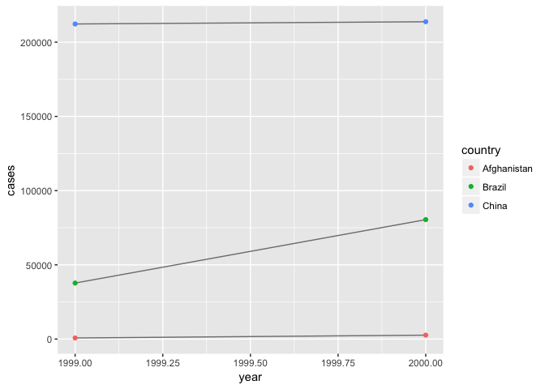

# R Notebook

Assignment_ June-14


```r
library(tidyverse)
```

```
## Loading tidyverse: ggplot2
## Loading tidyverse: tibble
## Loading tidyverse: tidyr
## Loading tidyverse: readr
## Loading tidyverse: purrr
## Loading tidyverse: dplyr
```

```
## Conflicts with tidy packages ----------------------------------------------
```

```
## filter(): dplyr, stats
## lag():    dplyr, stats
```


```r
table1
```

```
## # A tibble: 6 × 4
##       country  year  cases population
##         <chr> <int>  <int>      <int>
## 1 Afghanistan  1999    745   19987071
## 2 Afghanistan  2000   2666   20595360
## 3      Brazil  1999  37737  172006362
## 4      Brazil  2000  80488  174504898
## 5       China  1999 212258 1272915272
## 6       China  2000 213766 1280428583
```

```r
table2
```

```
## # A tibble: 12 × 4
##        country  year       type      count
##          <chr> <int>      <chr>      <int>
## 1  Afghanistan  1999      cases        745
## 2  Afghanistan  1999 population   19987071
## 3  Afghanistan  2000      cases       2666
## 4  Afghanistan  2000 population   20595360
## 5       Brazil  1999      cases      37737
## 6       Brazil  1999 population  172006362
## 7       Brazil  2000      cases      80488
## 8       Brazil  2000 population  174504898
## 9        China  1999      cases     212258
## 10       China  1999 population 1272915272
## 11       China  2000      cases     213766
## 12       China  2000 population 1280428583
```

```r
table3
```

```
## # A tibble: 6 × 3
##       country  year              rate
## *       <chr> <int>             <chr>
## 1 Afghanistan  1999      745/19987071
## 2 Afghanistan  2000     2666/20595360
## 3      Brazil  1999   37737/172006362
## 4      Brazil  2000   80488/174504898
## 5       China  1999 212258/1272915272
## 6       China  2000 213766/1280428583
```

```r
table4a
```

```
## # A tibble: 3 × 3
##       country `1999` `2000`
## *       <chr>  <int>  <int>
## 1 Afghanistan    745   2666
## 2      Brazil  37737  80488
## 3       China 212258 213766
```

```r
table4b
```

```
## # A tibble: 3 × 3
##       country     `1999`     `2000`
## *       <chr>      <int>      <int>
## 1 Afghanistan   19987071   20595360
## 2      Brazil  172006362  174504898
## 3       China 1272915272 1280428583
```


### Exercise 12.2.1

##### Question 1

Using prose, describe how the variables and observations are organised in each of the sample tables.

The first data table is a tidy table, as all observations are in rows, the variables are all in columns, and therefor the values are in cells. Table 2 has a column type, which contains two variables, cases and population, and count is the values for each of these two difference variables. Table 3 has a column rate, where it combines the values of cases/population, but it is not split up. Both table 4s have different columns for the years, one containing the values of cases, and the other the values for population.


##### Question 2


```r
# table2
table2_tidy <- table2 %>% spread(type, count)
table2_tidy
```

```
## # A tibble: 6 × 4
##       country  year  cases population
## *       <chr> <int>  <int>      <int>
## 1 Afghanistan  1999    745   19987071
## 2 Afghanistan  2000   2666   20595360
## 3      Brazil  1999  37737  172006362
## 4      Brazil  2000  80488  174504898
## 5       China  1999 212258 1272915272
## 6       China  2000 213766 1280428583
```

```r
cases <- table2_tidy %>% select(-population)
cases
```

```
## # A tibble: 6 × 3
##       country  year  cases
## *       <chr> <int>  <int>
## 1 Afghanistan  1999    745
## 2 Afghanistan  2000   2666
## 3      Brazil  1999  37737
## 4      Brazil  2000  80488
## 5       China  1999 212258
## 6       China  2000 213766
```

```r
population <- table2_tidy %>% select(-cases)
population
```

```
## # A tibble: 6 × 3
##       country  year population
## *       <chr> <int>      <int>
## 1 Afghanistan  1999   19987071
## 2 Afghanistan  2000   20595360
## 3      Brazil  1999  172006362
## 4      Brazil  2000  174504898
## 5       China  1999 1272915272
## 6       China  2000 1280428583
```

```r
table2_tidy <- table2_tidy %>% mutate(rate = (cases$cases/population$population)*10000)
table2_tidy
```

```
## # A tibble: 6 × 5
##       country  year  cases population     rate
##         <chr> <int>  <int>      <int>    <dbl>
## 1 Afghanistan  1999    745   19987071 0.372741
## 2 Afghanistan  2000   2666   20595360 1.294466
## 3      Brazil  1999  37737  172006362 2.193930
## 4      Brazil  2000  80488  174504898 4.612363
## 5       China  1999 212258 1272915272 1.667495
## 6       China  2000 213766 1280428583 1.669488
```


```r
# table 4s
table4a
```

```
## # A tibble: 3 × 3
##       country `1999` `2000`
## *       <chr>  <int>  <int>
## 1 Afghanistan    745   2666
## 2      Brazil  37737  80488
## 3       China 212258 213766
```

```r
table4b
```

```
## # A tibble: 3 × 3
##       country     `1999`     `2000`
## *       <chr>      <int>      <int>
## 1 Afghanistan   19987071   20595360
## 2      Brazil  172006362  174504898
## 3       China 1272915272 1280428583
```

```r
cases2 <- table4a %>%  gather(`1999`, `2000`, key = "year", value = "cases")
cases2
```

```
## # A tibble: 6 × 3
##       country  year  cases
##         <chr> <chr>  <int>
## 1 Afghanistan  1999    745
## 2      Brazil  1999  37737
## 3       China  1999 212258
## 4 Afghanistan  2000   2666
## 5      Brazil  2000  80488
## 6       China  2000 213766
```

```r
population2 <- table4b %>%  gather(`1999`, `2000`, key = "year", value = "population")
population2
```

```
## # A tibble: 6 × 3
##       country  year population
##         <chr> <chr>      <int>
## 1 Afghanistan  1999   19987071
## 2      Brazil  1999  172006362
## 3       China  1999 1272915272
## 4 Afghanistan  2000   20595360
## 5      Brazil  2000  174504898
## 6       China  2000 1280428583
```

```r
table4_tidy <- population2 %>% mutate(rate = (cases2$cases/population2$population)*10000) 
table4_tidy
```

```
## # A tibble: 6 × 4
##       country  year population     rate
##         <chr> <chr>      <int>    <dbl>
## 1 Afghanistan  1999   19987071 0.372741
## 2      Brazil  1999  172006362 2.193930
## 3       China  1999 1272915272 1.667495
## 4 Afghanistan  2000   20595360 1.294466
## 5      Brazil  2000  174504898 4.612363
## 6       China  2000 1280428583 1.669488
```

```r
#table4_tidy <- mutate(table4_tidy, cases2$cases)
#table4_tidy
```


##### Question 3


```r
library(ggplot2)
ggplot(table2_tidy, aes(year, cases)) + 
  geom_line(aes(group = country), colour = "grey50") + 
  geom_point(aes(colour = country))
```

<!-- -->

You gotta make it tidy.


### Exercise 12.3.3


##### Quesiton 1

Why are gather() and spread() not perfectly symmetrical?


```r
stocks <- tibble(
  year   = c(2015, 2015, 2016, 2016),
  half  = c(   1,    2,     1,    2),
  return = c(1.88, 0.59, 0.92, 0.17))

stocks
```

```
## # A tibble: 4 × 3
##    year  half return
##   <dbl> <dbl>  <dbl>
## 1  2015     1   1.88
## 2  2015     2   0.59
## 3  2016     1   0.92
## 4  2016     2   0.17
```

```r
stocks %>% 
  spread(year, return) %>% 
  gather("year", "return", `2015`:`2016`)
```

```
## # A tibble: 4 × 3
##    half  year return
##   <dbl> <chr>  <dbl>
## 1     1  2015   1.88
## 2     2  2015   0.59
## 3     1  2016   0.92
## 4     2  2016   0.17
```

Spread and gather are not symetrical, because when you spread you are telling it to take a column, first argument, and spread it out by the variables in that column. The second argument is values that will go into the cells of the new columns, formed from the variables from the first argument. When using gather, you first are naming the new column, you are creating to combine columns/variables, then you have to name the new coulmn of values that are spread throughtout the columns you are combining. And last here you are putting the columns you are combining. Spread only requires 2 arguments, and gather requires 3, this is because you in gather you have to tell it which columns you are putting into a new column, while spread will name the new columns based on the values within the column you are spreading. 


##### Question 2


```r
# Why does this code fail?

#table4a %>% gather(1999, 2000, key = "year", value = "cases")

table4a
```

```
## # A tibble: 3 × 3
##       country `1999` `2000`
## *       <chr>  <int>  <int>
## 1 Afghanistan    745   2666
## 2      Brazil  37737  80488
## 3       China 212258 213766
```

```r
table4a %>% gather(`1999`, `2000`, key = "year", value = "cases")
```

```
## # A tibble: 6 × 3
##       country  year  cases
##         <chr> <chr>  <int>
## 1 Afghanistan  1999    745
## 2      Brazil  1999  37737
## 3       China  1999 212258
## 4 Afghanistan  2000   2666
## 5      Brazil  2000  80488
## 6       China  2000 213766
```


##### Question 3

Why does spreading this tibble fail? How could you add a new column to fix the problem?


```r
people <- tribble(
  ~name,             ~key,    ~value,
  #-----------------|--------|------
  "Phillip Woods",   "age",       45,
  "Phillip Woods",   "height",   186,
  "Phillip Woods",   "age",       50,
  "Jessica Cordero", "age",       37,
  "Jessica Cordero", "height",   156)

people
```

```
## # A tibble: 5 × 3
##              name    key value
##             <chr>  <chr> <dbl>
## 1   Phillip Woods    age    45
## 2   Phillip Woods height   186
## 3   Phillip Woods    age    50
## 4 Jessica Cordero    age    37
## 5 Jessica Cordero height   156
```

```r
# people_spread_out <- people %>% spread(key, value)
```

Can't spread because you have 2 ages for the name Philip Woods. 


##### Question 4


```r
preg <- tribble(
  ~pregnant, ~male, ~female,
  "yes",     NA,    10,
  "no",      20,    12
)

preg
```

```
## # A tibble: 2 × 3
##   pregnant  male female
##      <chr> <dbl>  <dbl>
## 1      yes    NA     10
## 2       no    20     12
```

```r
gather(preg, sex, count, male, female) %>% mutate(pregnant = pregnant == "yes", female = sex == "female") %>% select(-sex)
```

```
## # A tibble: 4 × 3
##   pregnant count female
##      <lgl> <dbl>  <lgl>
## 1     TRUE    NA  FALSE
## 2    FALSE    20  FALSE
## 3     TRUE    10   TRUE
## 4    FALSE    12   TRUE
```


### Exercise 12.4.3


##### Question 1


```r
# What do the extra and fill arguments do in separate()? Experiment with the various options for the following two toy datasets?

?separate()

tibble(x = c("a,b,c", "d,e,f,g", "h,i,j")) %>% 
  separate(x, c("one", "two", "three"), extra = "drop")
```

```
## # A tibble: 3 × 3
##     one   two three
## * <chr> <chr> <chr>
## 1     a     b     c
## 2     d     e     f
## 3     h     i     j
```

```r
tibble(x = c("a,b,c", "d,e,f,g", "h,i,j")) %>% 
  separate(x, c("one", "two", "three"), extra = "merge")
```

```
## # A tibble: 3 × 3
##     one   two three
## * <chr> <chr> <chr>
## 1     a     b     c
## 2     d     e   f,g
## 3     h     i     j
```

```r
tibble(x = c("a,b,c", "d,e", "f,g,i")) %>% 
  separate(x, c("one", "two", "three"), fill = "right")
```

```
## # A tibble: 3 × 3
##     one   two three
## * <chr> <chr> <chr>
## 1     a     b     c
## 2     d     e  <NA>
## 3     f     g     i
```

```r
tibble(x = c("a,b,c", "d,e", "f,g,i")) %>% 
  separate(x, c("one", "two", "three"), fill = "left")
```

```
## # A tibble: 3 × 3
##     one   two three
## * <chr> <chr> <chr>
## 1     a     b     c
## 2  <NA>     d     e
## 3     f     g     i
```

Extra gives you options for what to do when there are too many pieces, if sep is a character vector. The options are to warn, drop, or merge. Fill is the opposite, where you have options when there are not enough pieces if sep is a character vector. These options are warn, right, and left.


##### Question 2

Both unite() and separate() have a remove argument. What does it do? Why would you set it to FALSE?


```r
?unite()
?separate()
```


The remove argument removes the input columns from the output data frame. I'd imagine you would set it to FALSE, if for some reason you still wanted the original column you are seperating, as well as the new columns.


##### Question 3


```r
# Compare and contrast separate() and extract(). Why are there three variations of separation (by position, by separator, and with groups), but only one unite?

?separate()
?extract()
```

```
## Help on topic 'extract' was found in the following packages:
## 
##   Package               Library
##   tidyr                 /Library/Frameworks/R.framework/Versions/3.3/Resources/library
##   magrittr              /Library/Frameworks/R.framework/Versions/3.3/Resources/library
## 
## 
## Using the first match ...
```

Seperate, turns 1 column into multiple, while extract turns multiple columns into 1.  


