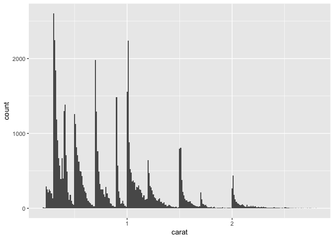
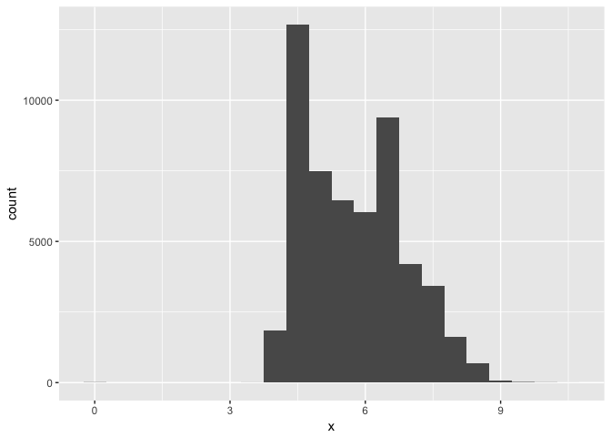

# R Notebook

### Assignment May 24


```r
library(tidyverse)
```

```
## Loading tidyverse: ggplot2
## Loading tidyverse: tibble
## Loading tidyverse: tidyr
## Loading tidyverse: readr
## Loading tidyverse: purrr
## Loading tidyverse: dplyr
```

```
## Conflicts with tidy packages ----------------------------------------------
```

```
## filter(): dplyr, stats
## lag():    dplyr, stats
```


```r
diamonds
```

```
## # A tibble: 53,940 × 10
##    carat       cut color clarity depth table price     x     y     z
##    <dbl>     <ord> <ord>   <ord> <dbl> <dbl> <int> <dbl> <dbl> <dbl>
## 1   0.23     Ideal     E     SI2  61.5    55   326  3.95  3.98  2.43
## 2   0.21   Premium     E     SI1  59.8    61   326  3.89  3.84  2.31
## 3   0.23      Good     E     VS1  56.9    65   327  4.05  4.07  2.31
## 4   0.29   Premium     I     VS2  62.4    58   334  4.20  4.23  2.63
## 5   0.31      Good     J     SI2  63.3    58   335  4.34  4.35  2.75
## 6   0.24 Very Good     J    VVS2  62.8    57   336  3.94  3.96  2.48
## 7   0.24 Very Good     I    VVS1  62.3    57   336  3.95  3.98  2.47
## 8   0.26 Very Good     H     SI1  61.9    55   337  4.07  4.11  2.53
## 9   0.22      Fair     E     VS2  65.1    61   337  3.87  3.78  2.49
## 10  0.23 Very Good     H     VS1  59.4    61   338  4.00  4.05  2.39
## # ... with 53,930 more rows
```

```r
?diamonds
ggplot(data = diamonds) +
  geom_bar(mapping = aes(x = cut))
```

<!-- -->


```r
diamonds %>% 
  count(cut)
```

```
## # A tibble: 5 × 2
##         cut     n
##       <ord> <int>
## 1      Fair  1610
## 2      Good  4906
## 3 Very Good 12082
## 4   Premium 13791
## 5     Ideal 21551
```


```r
diamonds %>% 
  count(cut_width(carat, 0.5))
```

```
## # A tibble: 11 × 2
##    `cut_width(carat, 0.5)`     n
##                     <fctr> <int>
## 1             [-0.25,0.25]   785
## 2              (0.25,0.75] 29498
## 3              (0.75,1.25] 15977
## 4              (1.25,1.75]  5313
## 5              (1.75,2.25]  2002
## 6              (2.25,2.75]   322
## 7              (2.75,3.25]    32
## 8              (3.25,3.75]     5
## 9              (3.75,4.25]     4
## 10             (4.25,4.75]     1
## 11             (4.75,5.25]     1
```


```r
smaller <- diamonds %>% 
  filter(carat < 3)
  
ggplot(data = smaller, mapping = aes(x = carat)) +
  geom_histogram(binwidth = 0.1)
```

<!-- -->


```r
ggplot(data = smaller, mapping = aes(x = carat, colour = cut)) +
  geom_freqpoly(binwidth = 0.1)
```

<!-- -->


```r
ggplot(data = smaller, mapping = aes(x = carat)) +
  geom_histogram(binwidth = 0.01)
```

<!-- -->


```r
ggplot(diamonds) + 
  geom_histogram(mapping = aes(x = y), binwidth = 0.5) +
  coord_cartesian(ylim = c(0, 50))
```

<!-- -->


```r
unusual <- diamonds %>% 
  filter(y < 3 | y > 20) %>% 
  select(price, x, y, z) %>%
  arrange(y)
unusual
```

```
## # A tibble: 9 × 4
##   price     x     y     z
##   <int> <dbl> <dbl> <dbl>
## 1  5139  0.00   0.0  0.00
## 2  6381  0.00   0.0  0.00
## 3 12800  0.00   0.0  0.00
## 4 15686  0.00   0.0  0.00
## 5 18034  0.00   0.0  0.00
## 6  2130  0.00   0.0  0.00
## 7  2130  0.00   0.0  0.00
## 8  2075  5.15  31.8  5.12
## 9 12210  8.09  58.9  8.06
```


### Exercise 7.3.4


##### question 1


```r
# explore the distribution of x, y, z
ggplot(diamonds) + 
  geom_histogram(mapping = aes(x = x), binwidth = 0.5)
```

<!-- -->

```r
ggplot(diamonds) + 
  geom_histogram(mapping = aes(x = x), binwidth = 0.1)
```

<!-- -->

```r
ggplot(diamonds) + 
  geom_histogram(mapping = aes(x = x), binwidth = 0.1) +
  coord_cartesian(ylim = c(0, 50))
```

<!-- -->

```r
ggplot(diamonds) + 
  geom_histogram(mapping = aes(x = z), binwidth = 0.5)
```

<!-- -->

```r
ggplot(diamonds) + 
  geom_histogram(mapping = aes(x = z), binwidth = 0.1)
```

<!-- -->

```r
ggplot(diamonds) + 
  geom_histogram(mapping = aes(x = z), binwidth = 0.1) +
  coord_cartesian(ylim = c(0, 30))
```

<!-- -->

In X, the measurements of length, the distribution falls mostly between 3-9, there are some outliers. For example there are multiple measurements of length 0, which is impossible. The same is true for Z, which is the depth. There are about 20 measurements of 0, which is impossible. As well as a measurement of ~ 31, which is improbable. 

##### question 2


```r
# distribution of price

ggplot(diamonds) + 
  geom_histogram(mapping = aes(x = price), binwidth = 0.5)
```

<!-- -->

```r
ggplot(diamonds) + 
  geom_histogram(mapping = aes(x = price), binwidth = 0.1)
```

<!-- -->

```r
ggplot(diamonds) + 
  geom_histogram(mapping = aes(x = price), binwidth = 1.0)
```

<!-- -->

```r
ggplot(diamonds) + 
  geom_histogram(mapping = aes(x = price), binwidth = 5.0)
```

<!-- -->

```r
ggplot(diamonds) + 
  geom_histogram(mapping = aes(x = price), binwidth = 0.5) +
  coord_cartesian(xlim = c(1200, 1700), ylim = c(0,50))
```

<!-- -->

There is an interesting gap of no diamonds costing between ~1450, and ~1550 dollars. 


##### question 3


```r
# How many diamonds are 0.99 carat? How many are 1 carat? What do you think is the cause of the difference?

diamonds %>% filter(carat == .99) %>% 
  count(carat)
```

```
## # A tibble: 1 × 2
##   carat     n
##   <dbl> <int>
## 1  0.99    23
```

```r
diamonds %>% filter(carat == 1) %>% 
  count(carat)
```

```
## # A tibble: 1 × 2
##   carat     n
##   <dbl> <int>
## 1     1  1558
```

There are 23 0.99 carat diamonds. There are 1558, 1 carat diamonds. People rounded up. 


##### question 4


```r
#Compare and contrast coord_cartesian() vs xlim() or ylim() when zooming in on a histogram. What happens if you leave binwidth unset? What happens if you try and zoom so only half a bar shows?

ggplot(diamonds) + 
  geom_histogram(mapping = aes(x = x ), binwidth = 0.5)
```

<!-- -->

```r
ggplot(diamonds) + 
  geom_histogram(mapping = aes(x = x ), binwidth = 0.5) +
  coord_cartesian(xlim = c(5, 9), ylim = c(0,10000))
```

<!-- -->

```r
ggplot(diamonds) + 
  geom_histogram(mapping = aes(x = x ), binwidth = 0.1) +
  coord_cartesian(xlim = c(5, 9), ylim = c(0,10000))
```

<!-- -->

```r
ggplot(diamonds) + 
  geom_histogram(mapping = aes(x = x ), binwidth = 0.5) + xlim(5,9) + ylim(0,10000)
```

```
## Warning: Removed 17628 rows containing non-finite values (stat_bin).
```

<!-- -->

```r
# bindwidth unset

ggplot(diamonds) + 
  geom_histogram(mapping = aes(x = x ))
```

```
## `stat_bin()` using `bins = 30`. Pick better value with `binwidth`.
```

<!-- -->

```r
ggplot(diamonds) + 
  geom_histogram(mapping = aes(x = x )) +
  coord_cartesian(xlim = c(5, 9), ylim = c(0,10000))
```

```
## `stat_bin()` using `bins = 30`. Pick better value with `binwidth`.
```

<!-- -->

```r
# half way zoom

ggplot(diamonds) + 
  geom_histogram(mapping = aes(x = x ), binwidth = 0.5) + coord_cartesian(ylim = c(0,6000))
```

<!-- -->

```r
ggplot(diamonds) + 
  geom_histogram(mapping = aes(x = x ))
```

```
## `stat_bin()` using `bins = 30`. Pick better value with `binwidth`.
```

<!-- -->

```r
ggplot(diamonds) + 
  geom_histogram(mapping = aes(x = x )) + coord_cartesian(ylim = c(0,6000))
```

```
## `stat_bin()` using `bins = 30`. Pick better value with `binwidth`.
```

<!-- -->


coord_cartesian zooms in on the numbers chosen. When you use xlim and y lim, it removes the data thats outside of those numbers. When you do not set a binwidth, it uses 30 bins, and the binwidth is set from there. 


### Exercise 7.4.1

##### question 1


```r
# What happens to missing values in a histogram? What happens to missing values in a bar chart? Why is there a difference?

diamonds2 <- diamonds %>% 
  mutate(y = ifelse(y < 3 | y > 20, NA, y))

ggplot(data = diamonds2, mapping = aes(x = y)) + 
  geom_histogram()
```

```
## `stat_bin()` using `bins = 30`. Pick better value with `binwidth`.
```

```
## Warning: Removed 9 rows containing non-finite values (stat_bin).
```

<!-- -->

```r
ggplot(data = diamonds2, mapping = aes(x = y)) + 
  geom_bar()
```

```
## Warning: Removed 9 rows containing non-finite values (stat_count).
```

<!-- -->


Histogram removed my NA values. And so did bar chart??


##### Question 2


```r
# What does na.rm = TRUE do in mean() and sum()

?mean()
?sum()
```


The na.rm = True is mean, strips the NA values before calculating. In sum, it also decides whether or not to remove the NA before calculating.


